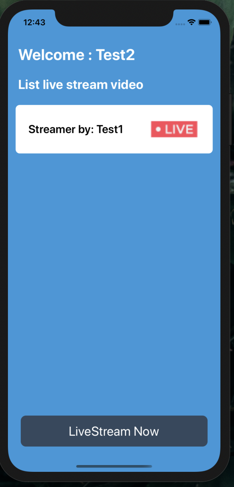

# React native live stream RTMP Example

An example live stream rtmp application using React native

## Demo v2

**Note: Here is demo for version 2.0**



## Demo v1

**Note: Here is demo for version 1.0**

| Streamer                                                                                                                  | Viewer                                                                                                                  |
| ------------------------------------------------------------------------------------------------------------------------- | ----------------------------------------------------------------------------------------------------------------------- |
|  |  |

## Feature

- ✅ Live Stream with input username account
- ✅ The video can replay
- ✅ Live update status when `Pending`, `On Live`, and `Finish` live streaming process
- ✅ Streamer and viewer can chat and send heart when livestream

## Teachnology using

- Using node-media-server

## Getting Started

We need the RTMP server first. Download the repository below and follow the README information.

Server : https://github.com/sieuhuflit/live-tream-rtmp-server

## Config

Then we check the _src/config.js_ to edit the server information. Fill in your localhost server information (Ip address, Port)

```js
export const SOCKET_IO_SERVER = 'http://192.168.5.143:3333'; // Edit this
export const RTMP_SERVER = 'rtmp://192.168.5.143'; // Edit this
```

## Install package

```bash
yarn install
```

## Running the App

### iOS

```bash
yarn run ios
```

### Android

```bash
yarn run run-android
```

## Common problem

`1/ Can't replay video.`

Make sure you are following live stream server step.
Install ffmpeg and do extra step to Replay live stream video

## License

[MIT](https://choosealicense.com/licenses/mit/)
